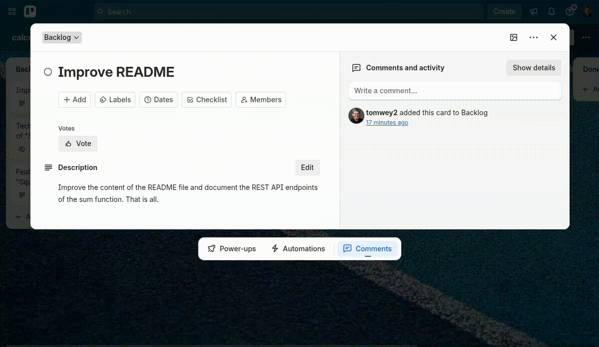
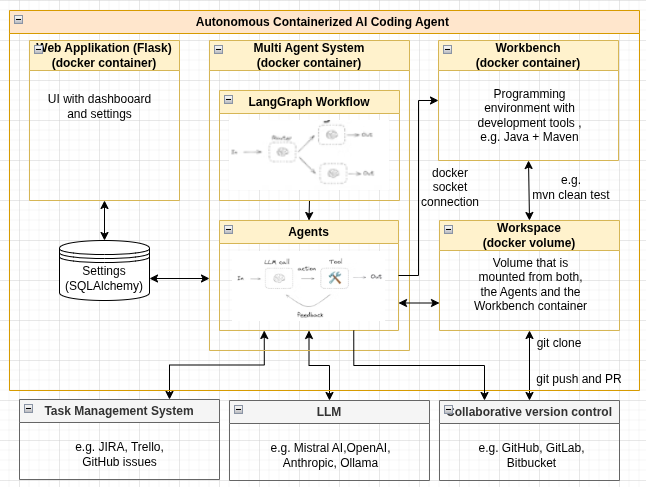
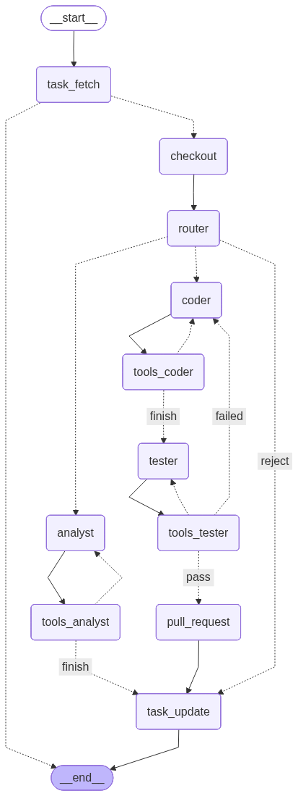
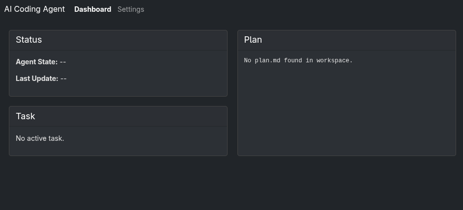
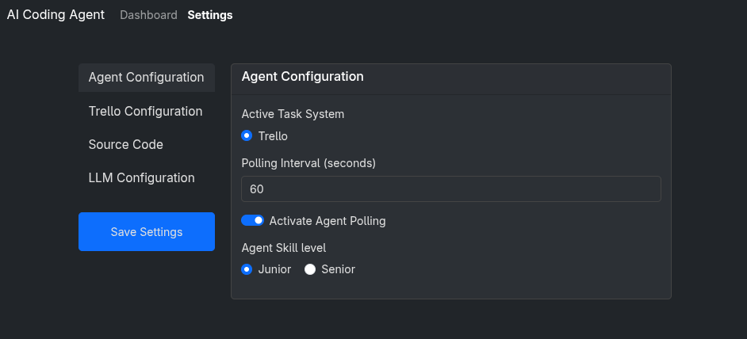

# CleanKoda - Autonomous Coding Agents to scale reliable Software Engineering

![Status][Status] 

[![Python][Python]][Python-url] [![LangChain][LangChain]][LangChain-url] [![Docker][Docker]][Docker-url] [![Flask][Flask]][Flask-url]

This project demonstrates a POC for an autonomous, containerized AI coding agent that lives in your Docker environment. 
It operates completely unsupervised to:

- **Connect** to your task management system (Trello is currently supported).
- **Pick up** open tickets automatically
- **Analyze/Write** code or fix bugs
- **Push** changes via pull requests to your remote repository

Containerization using Docker makes it possible to run the AI Agent anywhere: in the cloud as managed Service (SaaS), in the company network (as Enterprise Edition), or even locally on your computer.

## The Lean Startup Vision
**CleanKoda** is an autonomous AI software developer designed to counteract a potential next "software crisis" caused by declining demand for entry-level professionals. CleanKoda focuses on brownfield projects—the maintenance of complex, existing enterprise systems—to automate repetitive tasks. Its "trust-first" approach begins with low-risk tasks such as bug fixing and unit test development. The goal is to deliver maintainable and clean code changes so that the human experts are significantly relieved of routine work and can focus on high-level tasks.



The full strategy paper can be found here: [VISION and STRATEGY](VISION.md)

Here is a [short Video that explains the vision and strategy](https://weyrath.com/cleankoda_vision.mp4) (generated by Google's NotebookLM :) 

## Key Features

As a **Proof of Concept (POC)**, the system demonstrates the following advanced capabilities:

- **Multi-Agent Architecture:** Uses **LangGraph** to route tasks to specialized sub-agents (`Coder`, `Bugfixer`, `Analyst`, `Tester`, `Explainer`).
- **Autonomous Git Operations:** Manages the full Git lifecycle—cloning, branching, committing, pushing, and pull requests—using the **Model Context Protocol (MCP)**.
- **Explainable PR Descriptions (XAI):** On successful tests, an Explainer node synthesizes the implementation plan with thought and tool-action history from the database to generate a structured PR description.
- **Task Management Integration:** Connects to external task/issue management systems (e.g. Trello, JIRA) to retrieve assignments and report status updates automatically. This also controls the **Human in the Loop** process.
- **Resilient AI Logic:** Features advanced **self-healing mechanisms** with retry loops and iterative prompting to prevent stalling and minimize hallucinations.
- **Dockerized & Scalable:** Runs in secure, isolated containers, allowing for effortless horizontal scaling—simply spin up additional instances to expand your virtual workforce on demand.
- **LLM Selection:** Choose AI provider (OpenAI, Google, Mistral) and select a large LLMs for complex tasks and a small LLM for simple tasks, ensuring high-quality and precise results at optimized costs.
- **Workbench Integration:** Integrates workbenches to provide a development environment for the Coding Agent executing unit tests.
- **Trust-First Strategy:** The Coding Agent initially takes on repetitive tasks until trust in its work is established. Only then are more complex tasks addressed. 

## Future Roadmap: From POC to Professional SaaS

This Proof of Concept serves as the technological foundation for an upcoming startup venture. The goal is to evolve the system into a commercial, fully managed SaaS platform that integrates seamlessly into enterprise workflows.

Key milestones for professionalization include:

- [X] **Integrated Build Management & QA:** Implementation of industry-standard build tools (e.g., Maven, Gradle) directly within the agent's environment. Agents will compile code and execute local tests before committing, acting as a quality gate to ensure only functional, bug-free code enters the repository.
- [ ] **Active Code Reviews:** Agents will evolve from pure contributors to reviewers. They will analyze open Pull Requests, provide constructive feedback on code quality and security, and suggest optimizations—acting as an automated senior developer.
- [ ] **Collaborative Swarm Intelligence:** Moving beyond isolated tasks, agents will be capable of communicating and collaborating with each other. This "swarm" capability will allow multiple agents to work jointly on complex, large-scale features, ensuring architectural consistency across the codebase.
- [X] **Choose your preferred LLM** Support of other LLM providers, included open source models that run locally. 
- [ ] **Context Engineering** Optimize the agent's input with additional information (system prompt, coding plan, test results) that he needs to effectively perform his task.
- [ ] **Memory** to be able to refer back to past events and **learn** from feedback. 

**Commercialization & Next Steps** To realize this vision, we are transitioning this project into a dedicated startup. We plan to accelerate development through an upcoming crowdfunding campaign.

---

## System Architecture
The **CleanKoda** is designed as a modular, dockerized system that automates the software development lifecycle. The architecture separates the "reasoning engine" (the AI Agent) from the "execution environment" (the Workbench) to ensure security and stability.
The system interacts with several external services to fulfill the end-to-end workflow:
- Task Management System (e.g., Trello): Serves as the source of truth for incoming coding tasks. The agent fetches tasks from the backlog and updates their status upon completion.
- LLM Provider (e.g., Mistral, OpenAI): The inference engine used by the agents to generate code, reason about bugs, and analyze requirements.
- Collaborative Version Control (e.g., GitHub): The destination for the generated code. The agent automatically pushes changes and creates Pull Requests for human review.

The following diagram illustrates the high-level architecture of the system, highlighting the separation of concerns between the Agent and the Workbench:



The core system consists of the following key components:

1. **AI Coding Agent (Docker Container):** This container acts as the "brain" of the operation. It orchestrates the entire workflow and manages the decision-making process.
    - Web Application (Flask): Provides a user interface for configuring the agent. It uses SQLAlchemy for persistent data management (e.g., storing configuration states and history).
    - APScheduler: A background scheduler that triggers the agent's workflow periodically and handles asynchronous task execution, ensuring continuous operation without manual intervention.
    - LangGraph Workflow with specialist agents: A state machine that routes the development process from the initial task to the final Pull Request. It manages the state and transitions between different agents. A team of distinct AI agents (Coder, Bugfixer, Analyst, Tester, Explainer), each equipped with specific tools to perform granular tasks such as code analysis, writing syntax, test execution, and PR explanation.

2. **Workbench (Docker Container):** This container serves as the "sandbox" or execution environment. It contains all necessary development tools (e.g., Java JDK, Maven) required to build and test the target application. By isolating the build environment, the system ensures that arbitrary code execution does not affect the core agent logic.

3. **Shared Workspace (Docker Volume):** A shared storage volume mounted into both the AI Coding Agent and the Workbench containers. This allows the Agent to write code and the Workbench to compile and test that same code immediately.

### LangGraph Workflow
The system is built upon a stateful, multi-agent architecture powered by LangGraph. Instead of a monolithic process, the execution flow is intelligently orchestrated across specialized nodes. After successful test execution, the workflow routes through an Explainer node before Pull Request creation so that the generated PR body includes intent, reasoning, and verification context. The shared AgentState now carries `pr_description` for this handoff into PR creation.



* **Router Node:** The Routing workflows process inputs and then directs them to context-specific agents. It acts as the entry point. It analyzes the incoming ticket context and determines the optimal execution strategy by selecting the appropriate specialist. Additionally, the Router Node evaluates the complexity of the task and checks if the skill level of the agent is suitable for the task. This establishes the trust-first strategy, ensuring that agents are only assigned tasks they can handle effectively.

* **Specialist Nodes (Agents):**

  - **Coder:** Focuses on implementing new features and writing complex logic. This includes clean code strategies and a focus on modular, readable, and robust code. One specific form of this is **Bugfixer:**, who is specialized to fix errors with minimal changes to the codebase.

  - **Analyst:** Operates in read-only mode to perform code reviews, answer queries, or map out dependencies.

  - **Tester:** Executes unit tests in order to ensure the code is functioning as expected.

  - **Explainer:** Builds a structured PR description from the implementation plan plus the task-linked thought and tool-action history stored in SQLAlchemy (`AgentAction`). It uses `prompts/systemprompt_explainer.md` with the variables `plan`, `thoughts`, and `tools_used`, and intentionally does not consume git diff data in this MVP.

* **The Cognitive Loop** (Reasoning): The innermost circle. The agent "thinks," executes a tool (e.g., read_file), analyzes the output, and plans the next move. This is the classic **ReAct pattern** that makes complex problem-solving possible in the first place.

* **Self-Correction Loop** (Quality): This is where true reliability happens. Inspired by TDD (Test-Driven Development), our agent writes code, validates it against tests, and fixes its own bugs—before a human even sees the code. This is CleanKoda’s USP. It distinguishes rigorous Software Engineering from the current "Vibe Coding" approach.

## Tech Stack

* **Core:** Python 3.11+
* **Orchestration:** [LangGraph](https://langchain-ai.github.io/langgraph/)
* **AI Model:** ChatMistralAI, ChatOpenAI, ChatGoogleGenerativeAI via LangChain
* **Protocol:** [Model Context Protocol (MCP)](https://modelcontextprotocol.io/) (Git Server)
* **Infrastructure:** Docker & [UV (Package Manager)](https://docs.astral.sh/uv/)
* **Backend:** [Flask](https://en.wikipedia.org/wiki/Flask_(web_framework)), [SQLAlchemy](https://en.wikipedia.org/wiki/SQLAlchemy), APScheduler

---

## Getting Started

### Prerequisites

* **Docker** installed on your machine.
* A **Mistral AI API Key** or **OpenAI API Key** or **Google AI API Key** (requires a subscription/credits).
* A **GitHub Personal Access Token** (Classic) with `repo` scope.
* A **Trello Board**, for example with the Trello Agile Sprint Board Template (free account available)
* A **Trello API Key and Token** 
* A personal **GitHub repository** with a example program. You can copy my example repository to try it out: "calculator-spring-docker-jenkins".

### Prepare your running environment

#### 1. Clone this Repository at your local computer

#### 2. Generate your own Encryption Key

```bash
python3 -c "from cryptography.fernet import Fernet; print(Fernet.generate_key().decode())"
```

#### 3. Prepare your .env File 
The `dotenv` file of this repository can be used as template for your own `.env` file. Rename `dotenv` into `.env` and put your encryption key and your API keys into it. 

> **Attention: never commit any sensitive information to a open repository! Therefore, the .env file is added to the .gitignore file. Do not change this!**

You can provide the API key for each of providers you want to support. You can later select/switch the provider in the Dashboard of the Coding Agent.
Supported providers:

|Provider |Key environment variable|Additional config|
|---------|------------------------|-----------------|
|Mistral  |`MISTRAL_API_KEY`       | -               |
|OpenAI   |`OPENAI_API_KEY`        | -               |
|Google   |`GOOGLE_API_KEY`        | -               |
|Anthropic|`ANTHROPIC_API_KEY`     | -               |
|Ollama   |`OLLAMA_API_KEY` (optional for local setups)|`OLLAMA_BASE_URL` - default http://host.docker.internal:11434|

Other options:

|Context |Key environment variable|Description|
|---------|------------------------|-----------------|
|Instance directory|`INSTANCE_DIR`|Optional override for the SQLite folder (defaults to `app/instance`)|
|Workbench container|`WORKBENCH`|Name of the Docker container that hosts the runnable workbench (e.g., `workbench-backend`). Defaults to compose value if unset|
|Workbench workspace|`WORKBENCH_WORKSPACE`|Path to workspace inside the workbench container where commands are executed. Defaults to `WORKSPACE` value if not set|
|Agent stack override|`AGENT_STACK`|Force the runtime tech stack to `backend` or `frontend`. When omitted/invalid, the stack is derived from `WORKBENCH`|
|MCP control|`ENABLE_MCP_SERVERS` (default `true`)|Set to `false`/`0`/`no` to skip spawning the Git and task MCP servers when running locally|

#### 4. Run the Agent via Docker Container (recommended)
##### 4.1 Build the Image
```bash
docker compose up -d --build
```

##### 4.2 Open the Dashboard in browser
Open the agent dashboard in browser, e.g. http://localhost:5000.


If you want to run the agent without spawning MCP helper processes (e.g., when debugging locally or when MCP tooling is unavailable), set `ENABLE_MCP_SERVERS=false` (or `0`/`no`). The default is `true`, which launches both the Git MCP server and the task-system MCP server so the agent can execute repository and task-side commands.

##### 4.2 Stop the Container
```bash
docker compose down
```

### Run a Test Case 
#### 5. Configure the Coding Agent
Open the agent settings in browser, e.g. http://localhost:5000, and fill in the required fields. Press "Save Settings". The credential data are stored in a SQLite database encrypted using the Fernet encryption key.



#### 6. Prepare your Trello Board
Create new Cards at your Trello board in the list "Backlog" and move one into the list "Sprint Backlog". Here you can see an example:


#### 7. Agent runs automatically
The agent runs automatically when a new card is created in the "Sprint Backlog" list. It moves the card to the list "In Progress" and starts the workflow. It will generate or change the code based on the card description and create a pull request to your GitHub repository with a structured markdown description (Objective & Architecture, Developer's Journey, Quality Assurance).
After the PR creation it creates a comment in the card with the link to the pull request and move it to the list "In Review".

#### 8. Check the Results
Runs the coding agents successfully, check the card at your Trello board. There it should be a link to the pull request in GitHub. Check the results in the pull request.

**Please note: This is still a proof of concept.**

If the coding agent made a mistake, please let me know, e.g. on LinkedIn. 

## License
[Apache License 2.0](LICENSE)

## Contributing
Found a bug or have a feature idea? Check our [Contributing Guide](CONTRIBUTING.md) to get started.

## POC Results
[Results of the First POC](poc-results.md)

<!-- MARKDOWN LINKS & IMAGES -->
<!-- https://www.markdownguide.org/basic-syntax/#reference-style-links -->
[Status]: https://img.shields.io/badge/Status-POC-yellow?style=for-the-badge
[Build]: https://img.shields.io/badge/Built-passing-brightgreen?style=for-the-badge
[Python]: https://img.shields.io/badge/Python-3776AB?style=for-the-badge&logo=python&logoColor=white
[Python-url]: https://www.python.org/
[LangChain]: https://img.shields.io/badge/LangChain-3A3A3A?style=for-the-badge&logo=chainlink&logoColor=white
[LangChain-url]: https://www.langchain.com/
[Docker]: https://img.shields.io/badge/docker-257bd6?style=for-the-badge&logo=docker&logoColor=white
[Docker-url]: https://www.docker.com/
[Flask]: https://img.shields.io/badge/Flask-000000?style=for-the-badge&logo=Flask&logoColor=white
[Flask-url]: https://www.flask.palletsprojects.com/
