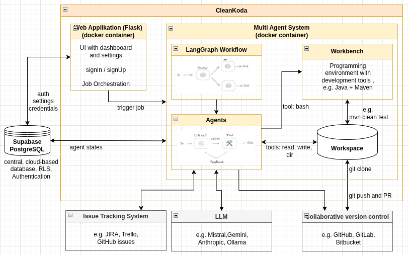
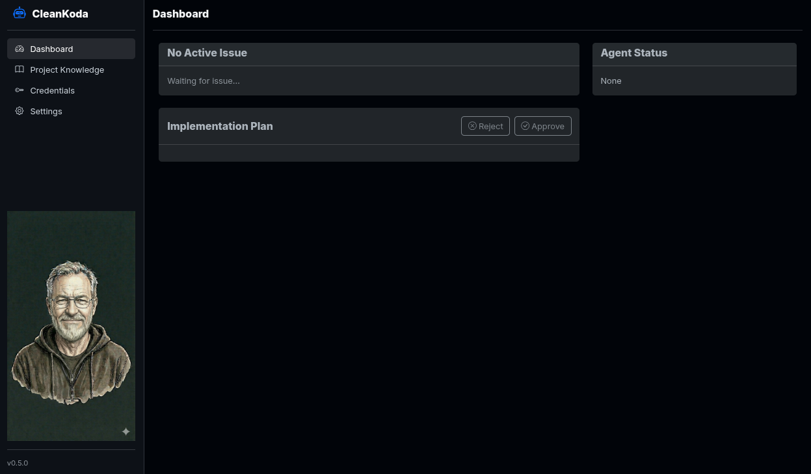
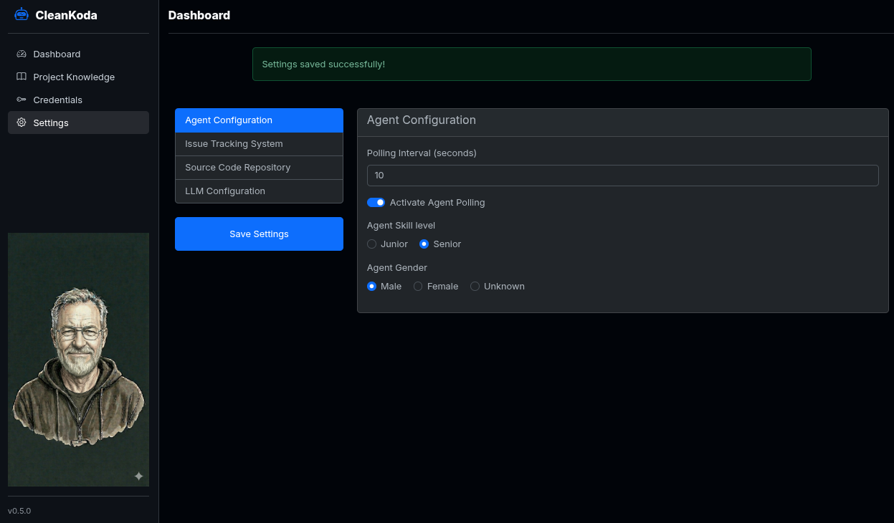
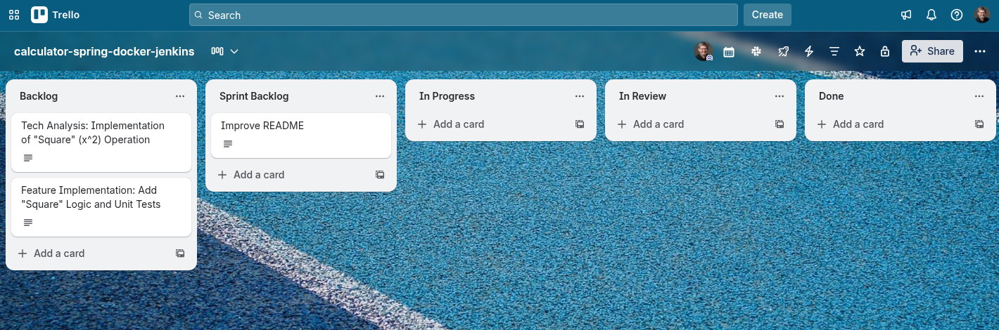

# CleanKoda - Autonomous Coding Agents to scale reliable Software Engineering

![Status][Status] 

[![Python][Python]][Python-url] [![LangChain][LangChain]][LangChain-url] [![Docker][Docker]][Docker-url] [![Flask][Flask]][Flask-url] [![GCP][GCP]][GCP-url]

**CleanKoda** is an autonomous, containerized AI software developer that operates completely unsupervised to:

- **Connect** to your task management system.
- **Retrieve** automatically the open tickets assigned to it.
- **Analyze** code, create a implementation plan to **write** code or fix bugs
- **Push** changes via pull requests to your remote repository

Containerization using Docker makes it possible to run the CleanKoda anywhere and secure: in the cloud as managed Service (SaaS), on premise in the company network (as Enterprise Edition), or even locally on your computer. 

CleanKoda is designed to counteract a potential next "software crisis" caused by declining demand for entry-level professionals (see recent studies of Stanford, ETH Zurich and Indeed). It focuses on brownfield projects—the maintenance of complex, existing enterprise systems—to automate repetitive tasks. Its "trust-first" approach begins with low-risk tasks such as bug fixing and unit test development. The goal is to deliver maintainable and clean code changes so that the human experts are significantly relieved of routine work and can focus on high-level tasks.
The full [Lean Startup Vision](VISION.md) and a [short video at LinkedIn](https://www.linkedin.com/posts/thomas-weyrath_ai-softwareengineering-futurofwork-activity-7432682072449630208--zRg?utm_source=share&utm_medium=member_desktop&rcm=ACoAADscgC8BiMUyz0spFR0jOVHwfm3BFtIuF_o) 

### Show Case


## Key Features

As a **Minimum Viable Product (MVP)**, the system demonstrates the following advanced capabilities:

**Already implemented:**
- **Multi-Agent Architecture:** Uses **LangGraph** to route tasks to specialized sub-agents (`Coder`, `Bugfixer`, `Analyst`, `Tester`, `Explainer`).
- **Resilient AI Logic:** AI workflows are robustly implemented through design patterns like loops (review & critique) and coordinator/router (hierarchical task decompostion). This enables advanced **self-healing mechanisms** with retry loops and iterative prompting to prevent stalling and minimize hallucinations.
- **Autonomous Git Operations:** Manages the full Git lifecycle—cloning, branching, committing, pushing, and pull requests—using the **Model Context Protocol (MCP)**.
- **Explainable PR Descriptions (XAI):** On successful tests, an Explainer node synthesizes the implementation plan with thought and tool-action history from the database to generate a structured PR description.
- **Issue Tracking System Integration:** Connects to external issue traccking systems (e.g. Trello, JIRA) to retrieve assignments and report status updates automatically. This also controls the **Human in the Loop** process.
- **Dockerized & Scalable:** Runs in secure, isolated containers (sandbox), allowing for effortless horizontal scaling—simply spin up additional instances to expand your virtual workforce on demand.
- **LLM Selection:** Choose AI provider (OpenAI, Google, Mistral) and select a large LLMs for complex tasks and a small LLM for simple tasks, ensuring high-quality and precise results at optimized costs.
- **Workbench Integration:** Integrates workbenches to provide a development environment for the Coding Agent executing unit tests.
- **Trust-First Strategy:** The Coding Agent initially takes on repetitive issues until trust in its work is established. Only then are more complex issues addressed. 
- **Integrated Build Management & QA:** Implementation of industry-standard build tools (e.g., Maven, Gradle) directly within the agent's environment. Agents will compile code and execute local tests before committing, acting as a quality gate to ensure only functional, bug-free code enters the repository.

**Currently in progress**
- **Supabase Integration:** Replace the SQL database with Supabase for better scalability and ease of use.
- **Google Cloud Integration:** Serverless deployment on Google Cloud Platform.
- **Gemma 4 as open LLM:** Usage of open source LLM from Google in order to reduce costs and data protection compliant.


## Future Roadmap: Towards a Professional SaaS

This Minimum Viable Product serves as the technological foundation for an upcoming startup venture. The goal is to evolve the system into a commercial, fully managed SaaS platform that integrates seamlessly into enterprise workflows.

Key milestones for professionalization include:

- [ ] **Active Code Reviews:** Agents will evolve from pure contributors to reviewers. They will analyze open Pull Requests, provide constructive feedback on code quality and security, and suggest optimizations—acting as an automated senior developer.
- [ ] **Collaborative Swarm Intelligence:** Moving beyond isolated tasks, agents will be capable of communicating and collaborating with each other. This "swarm" capability will allow multiple agents to work jointly on complex, large-scale features, ensuring architectural consistency across the codebase.
- [ ] **Skills and Context Engineering** Optimize the agent's input away from rigid, monolithic "Megaprompts" towards dynamic, skill-based prompt architecture, so that the agent only receives the specific context (skills) it needs for the current task.
- [ ] **RAG & Knowledge Retrieval:** Improve context depth in large-scale codebases through efficient retrieval using additional documents (requirements specifications, architecture documents)
- [ ] **Memory & Learning Capability** to be able to refer back to past events and **learn** from feedback. CleanKoda learns continuously by analysis of project documentation and builds implicit architectural and domain knowledge.

**Commercialization & Next Steps** To realize this vision, we are transitioning this project into a dedicated startup. We plan to accelerate development through an upcoming crowdfunding campaign.

---

## System Architecture
The **CleanKoda** is designed as a modular, dockerized system that automates the software development lifecycle. The architecture separates the "reasoning engine" (the AI Agent) from the "execution environment" (the Workbench) to ensure security and stability.
The system interacts with several external services to fulfill the end-to-end workflow:
- Issue Tracking System (e.g., Trello): Serves as the source of truth for incoming coding tasks. The agent fetches issues from the todo list and updates their status upon completion.
- LLM Provider (e.g., Mistral, Gemini, Anthropic): The inference engine used by the agents to generate code, reason about bugs, and analyze requirements.
- Collaborative Version Control (e.g., GitHub): The destination for the generated code. The agent automatically pushes changes and creates Pull Requests for human review.

The following diagram illustrates the high-level architecture of the system, highlighting the separation of concerns between the Agent and the Workbench:



👉 *Details see: [`software-architecture.md`](./doc/design/software-architecture.md)*

## Deployment

👉 *Details see: [`deployment.md`](./doc/design/deployment.md)*

## Tech Stack

* **Core:** Python 3.11+
* **Orchestration:** [LangGraph](https://langchain-ai.github.io/langgraph/)
* **AI Model:** ChatMistralAI, ChatOpenAI, ChatGoogleGenerativeAI via LangChain
* **Protocol:** [Model Context Protocol (MCP)](https://modelcontextprotocol.io/) (Git Server)
* **Infrastructure:** Docker & [UV (Package Manager)](https://docs.astral.sh/uv/), Google Cloud Platform (GCP)
* **Backend:** [Flask](https://en.wikipedia.org/wiki/Flask_(web_framework)), [SQLAlchemy](https://en.wikipedia.org/wiki/SQLAlchemy)

---

## Getting Started

### Prerequisites

* **Docker** installed on your machine.
* A **Mistral AI API Key** or **OpenAI API Key** or **Google AI API Key** (requires a subscription/credits).
* A **Trello Board**, for example with the Trello Agile Sprint Board Template (free account available)
* A **Trello API Key and Token** 
* A personal **GitHub repository** with a example program. You can copy my example repository to try it out: "calculator-spring-docker-jenkins".
* A **GitHub Personal Access Token** (Classic) with `repo` scope in order to create pull requests.

### Prepare your running environment

#### 1. Clone this Repository at your local computer

#### 2. Generate your own Encryption Key

```bash
python3 -c "from cryptography.fernet import Fernet; print(Fernet.generate_key().decode())"
```

#### 3. Prepare your .env File 
The `dotenv` file of this repository can be used as template for your own `.env` file. Rename `dotenv` into `.env` and put your encryption key and your API keys into it. 

> **Attention: never commit any sensitive information to a open repository! Therefore, the .env file is added to the .gitignore file. Do not change this!**

You can provide the API key for each of providers you want to support. You can later select/switch the provider in the Dashboard of the Coding Agent.
Supported providers:

|Provider |Key environment variable|Additional config|
|---------|------------------------|-----------------|
|Mistral  |`MISTRAL_API_KEY`       | -               |
|OpenAI   |`OPENAI_API_KEY`        | -               |
|Google   |`GOOGLE_API_KEY`        | -               |
|Anthropic|`ANTHROPIC_API_KEY`     | -               |
|Ollama   |`OLLAMA_API_KEY` (optional for local setups)|`OLLAMA_BASE_URL` - default http://host.docker.internal:11434|

Other options:

|Context |Key environment variable|Description|
|---------|------------------------|-----------------|
|Instance directory|`INSTANCE_DIR`|Optional override for the SQLite folder (defaults to `app/instance`)|
|Workbench container|`WORKBENCH`|Name of the Docker container that hosts the runnable workbench (e.g., `workbench-backend`). Defaults to compose value if unset|
|Workbench workspace|`WORKBENCH_WORKSPACE`|Path to workspace inside the workbench container where commands are executed. Defaults to `WORKSPACE` value if not set|
|Agent stack override|`AGENT_STACK`|Force the runtime tech stack to `backend` or `frontend`. When omitted/invalid, the stack is derived from `WORKBENCH`|
|MCP control|`ENABLE_MCP_SERVERS` (default `true`)|Set to `false`/`0`/`no` to skip spawning the Git and task MCP servers when running locally|

#### 4. Run the Agent via Docker Container (recommended)
##### 4.1 Build the Image
```bash
docker compose up -d --build
```

##### 4.2 Open the Dashboard in browser
Open the agent dashboard in browser, e.g. http://localhost:5000.


If you want to run the agent without spawning MCP helper processes (e.g., when debugging locally or when MCP tooling is unavailable), set `ENABLE_MCP_SERVERS=false` (or `0`/`no`). The default is `true`, which launches both the Git MCP server and the task-system MCP server so the agent can execute repository and task-side commands.

##### 4.2 Stop the Container
```bash
docker compose down
```

### Run a Test Case 
#### 5. Configure the Coding Agent
Open the agent settings in browser, e.g. http://localhost:5000, and fill in the required fields. Press "Save Settings". The credential data are stored in a SQLite database encrypted using the Fernet encryption key.



#### 6. Prepare your Trello Board
Create new Cards at your Trello board in the list "Backlog" and move one into the list "Sprint Backlog". Here you can see an example:



#### 7. Agent runs automatically
The agent runs automatically when a new card is created in the "Sprint Backlog" list. It moves the card to the list "In Progress" and starts the workflow. It will generate or change the code based on the card description and create a pull request to your GitHub repository with a structured markdown description (Objective & Architecture, Developer's Journey, Quality Assurance).
After the PR creation it creates a comment in the card with the link to the pull request and move it to the list "In Review".

#### 8. Check the Results
Runs the coding agents successfully, check the card at your Trello board. There it should be a link to the pull request in GitHub. Check the results in the pull request.

**Please note: This is still a proof of concept.**

If the coding agent made a mistake, please let me know, e.g. on LinkedIn. 

## License
[Apache License 2.0](LICENSE)

## Contributing
Found a bug or have a feature idea? Check our [Contributing Guide](CONTRIBUTING.md) to get started.

<!-- MARKDOWN LINKS & IMAGES -->
<!-- https://www.markdownguide.org/basic-syntax/#reference-style-links -->
[Status]: https://img.shields.io/badge/Status-MVP-green?style=for-the-badge
[Build]: https://img.shields.io/badge/Built-passing-brightgreen?style=for-the-badge
[Python]: https://img.shields.io/badge/Python-3776AB?style=for-the-badge&logo=python&logoColor=white
[Python-url]: https://www.python.org/
[LangChain]: https://img.shields.io/badge/LangChain-3A3A3A?style=for-the-badge&logo=chainlink&logoColor=white
[LangChain-url]: https://www.langchain.com/
[Docker]: https://img.shields.io/badge/docker-257bd6?style=for-the-badge&logo=docker&logoColor=white
[Docker-url]: https://www.docker.com/
[Flask]: https://img.shields.io/badge/Flask-000000?style=for-the-badge&logo=Flask&logoColor=white
[Flask-url]: https://www.flask.palletsprojects.com/
[GCP]: https://img.shields.io/badge/GCP-4285F4?style=for-the-badge&logo=google-cloud&logoColor=white
[GCP-url]: https://cloud.google.com/
