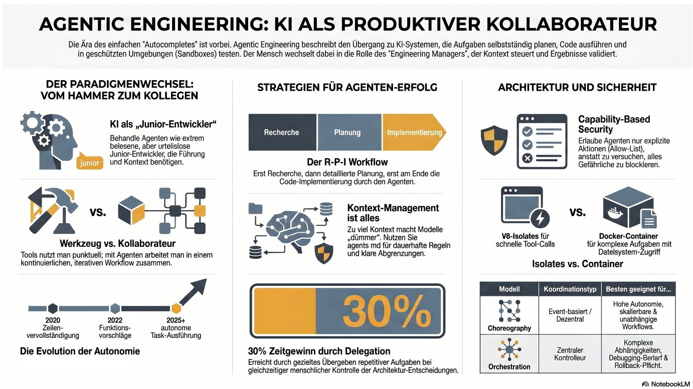

# Agentic Engineering

> Dieser Text wurde von NotebookLM auf Basis von Youtube Videos von der Konferenz "AI Engineer Europe 2026" generiert.

Das Thema „Softwareentwicklung und Agentic Engineering“ markiert einen fundamentalen Paradigmenwechsel in der Art und Weise, wie Software entsteht. Es geht nicht mehr nur um fortschrittliche Autovervollständigung, sondern um die tatsächliche Zusammenarbeit mit KI-Agenten, die Aufgaben zerlegen, Tests schreiben und Pull Requests erstellen

## Konzepte

Hier ist eine detaillierte Analyse der wichtigsten Konzepte, Herausforderungen und Best Practices aus dem aktuellen AI Engineering

### Das mentale Modell: Der unermüdliche Junior-Entwickler
Um Agentic Engineering erfolgreich zu nutzen, muss man das mentale Modell anpassen: Ein KI-Agent sollte wie ein energiegeladener, extrem belesener, aber oft auch selbstbewusst falscher Junior-Entwickler betrachtet werden. 

Dieser Agent arbeitet rasend schnell und kennt unzählige Frameworks, aber ihm fehlt das geschäftliche Urteilsvermögen und der Kontext für spezifische architektonische Entscheidungen. Daher darf man nicht jeden Vorschlag blind akzeptieren, sondern muss die Arbeit aktiv anleiten.

### Der „Research, Plan, Implement“-Workflow
Viele Entwickler machen den Fehler, Agenten direkt mit der Implementierung von Code zu beauftragen, was oft zu falschen Annahmen und Frustration führt. 

Ein wesentlich effektiverer Ansatz ist ein dreistufiger Zyklus:

- **Research (Forschung):** Der Agent darf noch keinen Code schreiben, sondern analysiert zunächst das System, um zu verstehen, wo Änderungen nötig sind und welche Edge Cases existieren.

- **Plan:** Es wird ein detaillierter Plan mit expliziten Schritten erstellt, der genau definiert, was geändert wird (und was nicht) und wie die Änderungen getestet werden.

- **Implement (Umsetzung):** Erst in einer neuen Session mit minimalem Kontext wird der Plan umgesetzt, wobei der Mensch die Änderungen wie bei einem Code-Review schrittweise überprüft.

### "Agent-Legible Codebases" (Agentenlesbare Codebasen)
KI-Agenten tun sich oft schwer mit komplexen, stark vernetzten Produkt-Codebasen, da sie den globalen Kontext nicht vollständig in ihr Kontextfenster laden können. Um erfolgreich zu sein, muss die Codebasis als Infrastruktur verstanden und für den Agenten lesbar ("agent-legible") gestaltet werden. Dazu gehören strikte Modularisierung, klare Schnittstellen und das Vermeiden von "versteckter Magie" (wie dynamische Imports), da der Agent Intentionen, die er nicht sieht, auch nicht respektieren kann. Auch mechanische Regeln helfen enorm: Eindeutige Funktionsnamen, das Vermeiden von "Catch-All"-Fehlerbehandlungen und einheitliche UI-Komponenten sorgen dafür, dass der Agent sich im Code besser orientieren kann.

### Die Gefahr der Geschwindigkeit und die Notwendigkeit von "Friction" (Reibung)
Die Geschwindigkeit, mit der KI Code generiert, ist extrem suchterzeugend und täuscht oft eine höhere Effizienz vor. Entwickler laufen Gefahr, den Überblick über ihren eigenen Code zu verlieren und massiv technische Schulden anzuhäufen. Da KI-Agenten primär darauf trainiert sind, Code lauffähig zu machen, ignorieren sie oft Best Practices und produzieren Code, der zu unerwarteten Ausfällen führen kann. Die Lösung besteht darin, bewusst "Friction" (Reibung) in den Prozess einzubauen. Bei kritischen Änderungen – wie Datenbankmigrationen, Berechtigungsänderungen oder dem Hinzufügen neuer Abhängigkeiten – muss der Workflow stoppen, damit der menschliche Entwickler sein Urteilsvermögen einschalten und eine bewusste Entscheidung treffen kann.

### Context Engineering & Tooling
Kontext ist teuer und mehr Kontext bedeutet nicht automatisch bessere Ergebnisse. Wenn das Kontextfenster zu etwa 50 % gefüllt ist, beginnen Modelle oft, fehlerhafter zu arbeiten. Entwickler müssen den Kontext streng kuratieren und beispielsweise alte oder irrelevante Tools deaktivieren, um den Agenten nicht zu verwirren. Einige Entwickler bauen sich sogar maßgeschneiderte, minimalistische Agenten-Umgebungen (wie das Tool "Pi"), um die volle Kontrolle darüber zu behalten, welche Prompts und Fehler im Hintergrund an das Modell gesendet werden.

### Sicherheit und Sandboxing
KI-generierter Code muss grundsätzlich wie nicht vertrauenswürdiger Code aus dem Internet behandelt werden. 

Neben einfachen Halluzinationen (wie Endlosschleifen, die Budgets auffressen) bestehen Risiken durch "überhilfreiche" Agenten, die versehentlich API-Keys auslesen, oder durch Prompt-Injections.

Solcher Code muss zwingend in isolierten Umgebungen (Sandboxes) ausgeführt werden, basierend auf dem Prinzip der "Capability-based Security": Dem Code wird standardmäßig alles verboten (Netzwerkzugriff, Dateisystem), und er erhält nur punktuell die Rechte, die er zwingend benötigt. 

Für schnelle, kleine Funktionen eignen sich leichtgewichtige "V8 Isolates", während komplexere Aufgaben (wie NPM-Installs) vollständige Container erfordern.