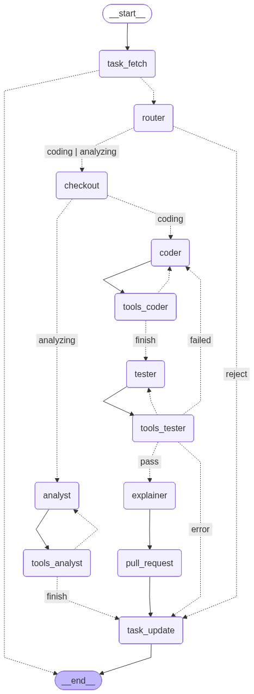

# AI Agent Workflows

👉 [Agenntic Engineering](./../business/agentic-engineering.md)

## Verwendung von LLMs zur Code Generierung

### Foundation Models
Große Foundation Models (von Mistral, Anthropic oder Google) bilden das intellektuelle Rückgrat der CleanKoda-Plattform in den höheren Preisplänen (PRO, TEAM, ENTERPRISE). Diese Modelle verfügen über ein tiefgehendes Verständnis dutzender Programmiersprachen und stark ausgeprägte Reasoning-Fähigkeiten (logisches Schlussfolgern). 

### Open Models (Gemma / LLaMA / Mistral)
Um den kostenlosen *START FREE* Plan anbieten zu können – oder bei stark reglementierten On-Premise-Umgebungen (*ENTERPRISE*) – greift CleanKoda auf hoch-effiziente, offene Weights (z. B. Gemma, Llama 3 oder Mistral) zurück. 
Hierbei kommt eine Strategie von "Small Language Models" für spezifische Teilaufgaben zum Einsatz. Da diese Modelle weitaus ressourcenschonender zu hosten sind, eignen sie sich extrem gut für simple, wiederholbare Router-Entscheidungen, rudimentäre Bugfixes oder Basisanalysen. Im On-Premise-Bereich garantieren sie hundertprozentigen Datenschutz, da der Code den Firmenserver nie verlässt.

## CleanKoda Restriktionen

### Schwächen der aktuellen Codegenerierungsansätze
Klassisches "Vibe Coding" oder isolierte Chatbot-Interfaces (wie simple ChatGPT-Prompts oder GitHub Copilot) stoßen bei weitreichenden Änderungen schnell an ihre Grenzen. Die primären Probleme sind:
- **"Context-Bleed" und Halluzinationen:** Das LLM hat keinen perfekten Überblick über das gesamte Repository und halluziniert Variablen oder Methoden, die in anderen Dateien ganz anders definiert, oder nicht vorhanden sind.
- **Fehlende Iteration:** Code wird einmalig generiert. Ist ein Komma falsch gesetzt, scheitert der gesamte Deployment-Bau. Es fehlt der autonome Trial-and-Error Prozess.
- **Keine Validierung:** Es mangelt an proaktivem Test-Driven-Development. Code wird vorgeschlagen, ohne dass der Agent vorher beweist, dass es im lokalen Systemkomplex fehlerfrei läuft.

### CleanKoda Lösungsansatz
CleanKoda geht über reine Code-Generierung hinaus durch **Agentic Engineering**:
- **Exploratives Tooling statt Raten:** Agenten verlassen sich nicht nur auf initial bereitgestellte Chunks, sondern evaluieren unbekannten Quellcode durch interaktives Suchen (`grep_search`), Navigieren (`list_dir`) und tiefgründiges Lesen (`view_file`), genau wie ein menschlicher Softwareentwickler.
- **"Self-Correction Loop":** Der Coder-Agent implementiert Modifikationen, aber unmittelbar danach triggert der Tester-Agent (`run_bash` Unit-Tests). Schlägt der Compiler oder Linter an, wird der Output ("Error Traceback") dem Coder als direktes Feedback zum Beheben der eigenen Fehler übergeben. Ein Code gelangt erst als Pull-Request in das System, wenn alle Pipelines auf "Grün" schalten.

## Agent Architecture

### Agent Patterns

[LangGraph Workflows and Agent Patterns](https://docs.langchain.com/oss/python/langgraph/workflows-agents)

* **The Cognitive Loop** (Reasoning): Der innerste Kreis. Der Agent „denkt“, führt ein Werkzeug aus (z. B. `read`), analysiert das Ergebnis und plant den nächsten Schritt. Dies ist das klassische **ReAct-Muster**, das die Lösung komplexer Probleme überhaupt erst ermöglicht.

* **Self-Correction Loop** (Quality): Das erhöht die Zuverlässigkeit. Inspiriert von TDD (Test-Driven Development), schreibt unser Agent Code, validiert ihn gegen Tests und behebt seine eigenen Fehler – bevor ein Mensch den Code überhaupt sieht. Das ist CleanKoda’s USP. Es unterscheidet rigorose Softwareentwicklung vom aktuellen "Vibe Coding"-Ansatz.

### LangGraph Workflow & Ticket-Lebenszyklus
Das System basiert auf einer zustandsbehafteten Multiagentenarchitektur (stateful, multi-agent architecture) mit LangGraph.

**Der chronologische Ticket-Lebenszyklus:**
1. **Trigger:** Ein Webhook (z.B. neues GitHub/Jira Issue) markiert den Start des Jobs.
2. **Context Loading:** Das System lädt Ticket-Metadaten und initialen Kontextvorrat in den State.
3. **Analysis & Plan:** Der Analyst-Node bewertet die Machbarkeit und skizziert eine saubere Architektur.
4. **Code & Test (Loop):** Coder und Tester iterieren den Code solange, bis alle funktionalen Anforderungen und Unit-Tests erfüllt sind.
5. **PR Creation:** Der Code wird gepusht und der *Explainer* baut final einen Pull-Request auf GitHub/Bitbucket zusammen.

**Human-in-the-Loop (Menschliche Freigabe):**
CleanKoda committet niemals direkt auf den Main/Master-Branch! Der erzeugte Pull-Request erzwingt zwingend einen manuellen Code-Review durch einen menschlichen Supervisor. Akzeptiert der Supervisor den PR, ist das Ticket abgeschlossen. Lehnt der Supervisor den PR mit Kommentaren ab, startet der Workflow-Loop erneut: Diesmal mit dem menschlichen Feedback als zusätzlichem Prompt für den Coder, um nachzubessern.

* **Router Node:** Der Router-Knoten ist der Einstiegspunkt in den Coding Prozess. Er analysiert den Kontext des eingehenden Tickets und bestimmt die optimale Bearbeitungsstrategie durch Auswahl des passenden Spezialisten (Analyst, Coder, Bugfixer). Zusätzlich bewertet der Router-Knoten die Komplexität der Aufgabe und prüft, ob die Qualifikation des Agenten für die Aufgabe ausreicht. Dies gewährleistet eine vertrauensbasierte Strategie (Trust-first), die sicherstellt, dass Agenten nur Aufgaben zugewiesen bekommen, die sie effektiv bearbeiten können.

* **Specialist Nodes (Agents):**

  - **Analyst:** Der Analyst arbeitet im Nur-Lese-Modus. Der Analyst analysiert die Aufgabe und erstellt einen Implementierungsplan. Damit wird die Recherche-Planungs Strategie umgesetzt.

  - **Coder:** Der Fokus liegt auf der Implementierung neuer Funktionen und dem Schreiben komplexer Logik. Dazu gehören Strategien für sauberen Code sowie die Entwicklung von modularem, lesbarem und robustem Code. Eine spezielle Form des Coder ist der **Bugfixer**, der darauf spezialisiert ist, Fehler mit minimalen Änderungen am Quellcode zu beheben.

  - **Tester:** Der Tester führt Unit-Tests aus, um sicherzustellen, dass der Code wie erwartet funktioniert. Er nutzt dafür die Workbench mit der Entwicklungsumgebung und das Tool `bash`, um die Kommandos aufzurufen. Sind nicht alle Tests erfolgreich, geht es zurück zum Coder (failed), ansonsten zum Explainer (pass).

  - **Explainer:** Der Explainer erstellt eine strukturierte PR-Beschreibung aus dem Implementierungsplan sowie der Historie der Gedanken und Werkzeugaktionen, die mit der Aufgabe verknüpft sind und in SQLAlchemy (`AgentAction`) gespeichert sind. Er verwendet `prompts/systemprompt_explainer.md` mit den Variablen `plan`, `thoughts` und `tools_used` und verbraucht absichtlich keine Git-Diff-Daten in diesem MVP.

### Context Management & RAG (Retrieval-Augmented Generation)
Ein kritischer Punkt bei großen Enterprise-Codebases ist das Token-Limit gängiger LLMs. Selbst riesige Context-Windows (>1 Mio Tokens) reichen oft nicht für unbegrenzte Dateivolumen aus und verursachen erhebliche Inferenzkosten. 
CleanKoda löst dieses Problem durch **Context Management**: Der Agent lädt nicht blind das gesamte Projekt in den Speicher. Erste Anlaufstelle ist ein RAG-Pattern (Retrieval-Augmented Generation). Durch schnelles Embedding lokaler Codebestände (über Vector-Stores) kann der Agent semantisch nach Code-Ausschnitten suchen, die relevant für das Ticket klingen, um so den Suchradius auf wenige Dateien einzudampfen, bevor er deren Inhalte final per `view_file` detailliert ausliest.

### Agent Tools
Die Arbeitsgeschwindigkeit und Präzision der CleanKoda-Agenten beruht stark auf fein-granularen, stark getypten Werkzeugen (Tools), die ihnen über das Backend als REST/Python-Adapter zugänglich gemacht werden. 
Zu den Basis-Werkzeugen gehören:
- **Dateisystem-Interaktion:** `read` (Lesen von Dateien), `ls` (Ordnerstruktur verstehen), `write` (Schreiben von Dateien).
- **System-Zugriff:** Kontrollierte Bash-Umgebungen (`bash`) zum Kompilieren oder für den Lauf von Test-Suites.
> **Hinweis:** Alle potentiell destruktiven oder System-Zustände manipulierende Tools werden stark gesichert ausgeführt (im Falle der Cloud via isolierter Serverless-Funktionen / Sandboxes), um einen "Ausbruch" (Escape) zu verhindern.

### Agent Memory

Das Gedächtnis des Agenten wird in der CleanKoda-Architektur funktional in zwei zeitliche Dimensionen unterteilt:

#### Short-Term Memory
In einer modernen LangGraph-Topologie besteht das Kurzzeitgedächtnis für den aktuellen Joblauf typischerweise aus zwei strikt getrennten In-Memory Konzepten:
1. **Session (Messages / History):** Ein append-only Log. Dieses Protokoll beinhaltet den reinen Dialog-Verlauf zwischen System, Agent und allen ausgeführten Tool-Calls (sowie deren Ergebnissen). Es wandert linear mit dem Agenten durch den Workflow-Graphen.
2. **State (Context / Key-Value):** Ein strukturierter, überschreibbarer Systemzustand (oft als Pydantic Model oder TypedDict definiert). Hier speichert der Agent konkrete erarbeitete Fakten ab, um sie nicht bei jedem Prompting aus der langen Session neu extrahieren zu müssen (z. B. das aktuelle Ticket `current_task_info`, den Plan oder Loop-Counter).

#### Persistent Memory
Um das System resilient (ausfallsicher) zu gestalten, muss das reine In-Memory-Wissen gesichert werden. CleanKoda nutzt hierfür Supabase (`agent_states` und `agent_actions`) als **Persistent Memory**. 
Eine Callback-Routine (ein Point-in-Time Checkpointer) synchronisiert sowohl den kompletten *State* als auch die bisherigen *Session-Messages* bei bestimmten Knotensprüngen asynchron in die PostgreSQL-Datenbank.

Das bringt drei entscheidende Backend-Vorteile:
- **Asynchrone Multi-Step Workflows:** Die Bearbeitung eines Tickets erfolgt selten in einem einzigen, monolithischen Job-Run. Der Workflow ist asynchron: Ein erster Job-Aufruf liest den Code und plant, ein zweiter Aufruf iteriert den Code und erstellt den Pull-Request, und ein dritter Job-Aufruf (ausgelöst durch Feedback eines menschlichen Reviewers) überarbeitet die Codeänderungen und aktualisiert den bestehenden PR. Durch das persistente Gedächtnis kann die Engine bei jedem neuen Job-Aufruf den exakt aktuellen Stand (Historie, Pläne, Code-Basis) laden und nahtlos am selben Problem weiterarbeiten.
- **Resilience / Restartability:** Bricht ein Cloud Run Container unerwartet ab (z.B. Timeout) oder startet der On-Premise Server neu, kann der Agent exakt an dem Punkt und mit exakt demselben Gedächtnisstand weiterarbeiten, an dem er unterbrochen wurde.
- **Observability:** Frontend und Operations-Support können das "Denken" des Agenten in Echtzeit im Dashboard verfolgen, da sie direkt auf das Persistent Memory (Supabase) zugreifen, ohne mit dem isolierten Agenten-Container direkt kommunizieren zu müssen.

### Agent Skills
Tools repräsentieren Fähigkeiten "Was ein Agent tun kann" (Hardware-Aktionen), während **Skills** dem Agenten vorgeben, "Wie ein Agent in genau diesem Projektumfeld arbeiten sollte" (Soft-Knowhow).
Skills sind dokumentierte Leitfäden (z. B. als `.md`-Dateien bereitgestellt), die projektbezogene Best Practices für Unit-Tests, Code-Strukturierung oder Architektur-Reviews beinhalten. Agenten laden diese Skills in Abhängigkeit zum gerade gewählten Kontext (z. B. den "Python-Flask-Testing-Skill") in ihren Kontext-(System-)Prompt. Durch diesen Mechanismus können Agenten projektspezifisches Wissen (Zero-Shot) extrem zügig adaptieren.
