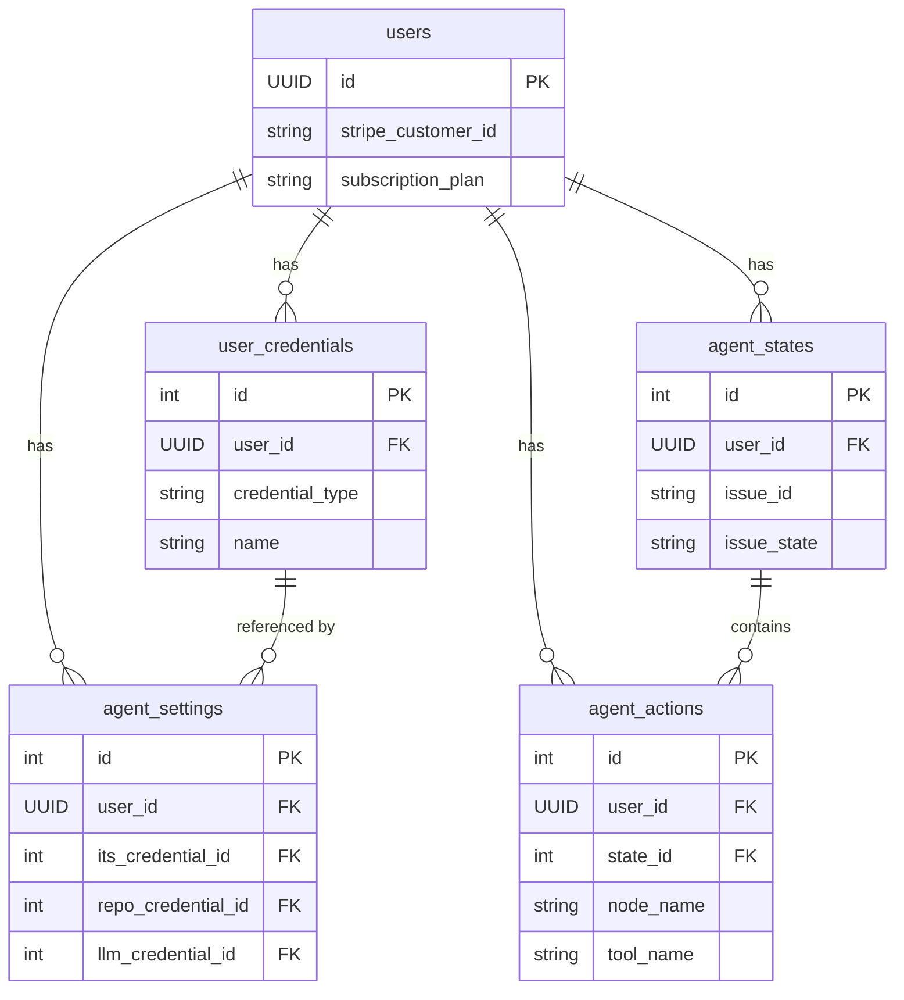

# Database & Multi-tenancy (Supabase)

Um eine zustandslose Architektur zu gewährleisten, ersetzt Supabase (serverloses PostgreSQL) lokale Datenbanken vollständig.

Issues:
- [Google Cloud: Initial Supabase project setup & database schema #179](https://github.com/tomwey2/cleankoda/issues/179)
- [Google Cloud: Implementation of multi-tenancy in Supabase #180](https://github.com/tomwey2/cleankoda/issues/180)
- [Google Cloud: Secure BYOK (Bring Your Own Key) management with Supabase & pgcrypto #182](https://github.com/tomwey2/cleankoda/issues/182)

## Key Features

**1. Auth & Identity:** Supabase verwaltet das Anmeldesystem (JWT-Token) sicher und skalierbar: Supabase übernimmt das gesamte Anmeldesystem (z. B. "E-Mail/Passwort", "Mit GitHub anmelden" oder "Mit Google anmelden"). Flask muss keine Passwörter speichern. Wir verwenden die sicheren JWT-Token (JSON Web Tokens) von Supabase, um Benutzersitzungen im Dashboard zu verwalten.

**2. Multi-tenancy (RLS):** Jeder Tabelle ist eine Mandanten-ID (tenant_id) zugewiesen. Die Zeilenebenensicherheit (Row Level Security, RLS) von Supabase stellt auf Datenbankebene sicher, dass ein Benutzer nur Zeilen lesen oder bearbeiten kann, deren Mandanten-ID mit seiner eigenen Benutzer-ID übereinstimmt. Selbst im Falle eines Fehlers in unserem Flask-Backend kann Kunde A niemals die Daten von Kunde B einsehen.

**3. Operations Dashboard:** Die Weboberfläche von Supabase Studio dient als direktes Administrationspanel. CleanKoda benötigt kein eigenes Administrationspanel. Supabase Studio (Weboberfläche) fungiert als Kontrollzentrum: Hier sehen Sie sofort neue Registrierungen, aktive Agentenaufträge, verbundene Repositories und können im Falle von Supportanfragen direkt die Protokolle (Tabelle „agent_logs“) eines bestimmten Auftrags einsehen.

## Datamodel

Das relationale Datenmodell baut vollständig auf Supabase (PostgreSQL) auf und ist strukturiert, um die Kernfunktionen der Applikation und des Agenten zu unterstützen. 

👉 Die vollständige Definition des Datenmodells befindet sich in der Datei [`datamodel.sql`](./datamodel.sql).

Die wichtigsten Tabellen des Datenmodells umfassen:

- **`users`**: Eine Erweiterung der internen Supabase `auth.users` Tabelle. Hier werden Profilinformationen, Stripe-Abonnementdetails (z. B. `FREE`, `PRO`) und DSGVO-Einwilligungen gespeichert. Ein Datenbank-Trigger sorgt dafür, dass bei Neuanmeldungen in Supabase Auth automatisch die entsprechenden Einträge in dieser Tabelle erzeugt werden.
- **`user_credentials`**: Dient zur sicheren Ablage von verschlüsselten Anmeldedaten für externe Systeme (z. B. GitHub, Jira, Trello oder LLM-Anbieter). Kritische Felder wie Passwörter oder API-Keys werden mit `pgcrypto` verschlüsselt in `BYTEA` Spalten gespeichert.
- **`agent_settings`**: Enthält die benutzerspezifische Konfiguration für den CleanKoda-Agenten. Hier werden die Verbindungen zum Issue-Tracking-System (ITS), Repository und LLM-Provider konfiguriert sowie globale Agenten-Einstellungen (z. B. Polling-Intervall) festgelegt.
- **`agent_states`**: Speichert den aktuellen Bearbeitungszustand eines Tickets (Issue). Dazu gehören Metadaten des Issues, der zugewiesene Branch-Name, PR-Links sowie der aktuell generierte Implementierungsplan und der allgemeine Status der Bearbeitung.
- **`agent_actions`**: Ein Audit-Log, das detailliert aufzeichnet, welche Werkzeuge und konkreten Aktionen (Tool Calls) der Agent im Rahmen eines bestimmten Jobs (`agent_states`) ausgeführt hat. Dies ist elementar für das Nachvollziehen der LLM-Schritte.

## Multi-tenancy

Die Mandantenfähigkeit (Multi-tenancy) ist ein zentraler Architekturbaustein. Da alle Benutzer auf dieselbe physische Datenbank zugreifen (Shared Database, Shared Schema Ansatz), muss eine strikte Datenisolierung gewährleistet sein.

**Wichtigste Aspekte der Mandantenfähigkeit:**
- **Datenisolierung (Tenant Isolation):** Sicherstellen, dass ein Mandant niemals die Daten (z. B. Agents, Jobs, Logs oder Credentials) eines anderen Mandanten einsehen oder verändern kann.
- **Identifikation (Tenant Identification):** Der Kontext jeder Anfrage muss eindeutig einer Tenant-ID zugeordnet werden können. Hierfür stellt die Flask App entsprechende `signIn` und `logout` Funktionen bereit, um die Sitzung des Benutzers zu verwalten.
- **Security in Depth (Zentrale Durchsetzung):** Die Durchsetzung von Zugriffsrechten sollte nicht nur in der Applikationslogik (Backend) erfolgen. Bugs oder vergessene Filter-Klauseln im Code würden sonst zu unmittelbaren Datenlecks führen.

**Wie Supabase die Mandantenfähigkeit unterstützt:**

1. **Row Level Security (RLS):** Da Supabase auf PostgreSQL basiert, lassen sich Sicherheitsrichtlinien direkt auf Ebene einzelner Tabellenzeilen definieren. Im Datenmodell erhält jede mandantenbezogene Tabelle eine `user_id` Spalte.
2. **Datenbank-Kontext durch JWT:** Bei Datenbankanfragen baut Supabase den Sicherheitskontext automatisch anhand des übergebenen JWT-Tokens des Benutzers auf (z.B. über die Funktion `auth.uid()`).
3. **Fail-Safe Policies:** Eine RLS-Policy verknüpft diese Komponenten in der Datenbank. Eine Policy wie `USING (user_id = auth.uid())` wirkt als unsichtbarer Türsteher. Selbst wenn das Backend eine unzureichend gefilterte Abfrage absetzt, liefert die Datenbank ausschließlich die Zeilen des authentifizierten Mandanten zurück. Dies bildet ein unverzichtbares Sicherheitsnetz für das Gesamtsystem.

## Authentication

CleanKoda delegiert die gesamte Authentifizierung und das Identitätsmanagement an **Supabase Auth**. Die Flask-Applikation speichert selbst keine Passwörter und implementiert keine eigene Krypto-Sicherheit für den Login.

**Wichtigste Aspekte von Supabase Auth:**

1. **Zentrale Identitätsverwaltung:** Supabase Auth verwaltet alle Benutzerkonten (in der Systemtabelle `auth.users`) und bietet Out-of-the-box-Unterstützung für E-Mail/Passwort sowie verschiedene OAuth-Provider (z. B. GitHub, Google).
2. **Standardisierte JWT-Tokens:** Bei einem erfolgreichen Login stellt Supabase ein JSON Web Token (JWT) als Access-Token sowie ein Refresh-Token aus. Das JWT enthält kryptographisch gesichert die Identität des Benutzers (insbesondere die User-ID).
3. **Nahtlose Datenbank-Integration:** Zusammen mit der Row Level Security (RLS) ist das Access-Token der wesentliche Schlüssel zur sicheren Datenbank. Supabase wertet das Token bei jeder Abfrage automatisch aus, um den Geltungsbereich zu evaluieren (z. B. über die Funktion `auth.uid()`).

**Nutzung und Integration in die Flask App:**

Die Anbindung in Flask erfolgt über ein robustes Zusammenspiel aus Supabase-Client und serverseitigen Flask-Sessions:

- **Login / Sign-In:** Wenn ein Benutzer seine Zugangsdaten eingibt, authentifiziert das Backend diese über `supabase.auth.sign_in_with_password()`. Schlägt der Login fehl, erhält der Nutzer eine Fehlermeldung.
- **Session Management:** Im Erfolgsfall speichert die Flask App den resultierenden `access_token` und `refresh_token` sicher in der lokalen **Flask Session** (verschlüsseltes Cookie).
- **Autorisierung von Requests:** Bei geschützten Routen (z. B. dem Dashboard) prüft Flask das Vorhandensein des `access_token` in der Session. Fehlt dieses oder ist es abgelaufen, wird der Nutzer automatisch auf die Login-Seite umgeleitet.
- **Authentifizierter Supabase-Client:** Für Datenbankabfragen wird der gespeicherte Access-Token verwendet, um den API-Client für den aktuellen Request für den jeweiligen Benutzer zu initialisieren (über `supabase.auth.set_session(access_token, refresh_token)`). Dadurch greifen sofort und fehlerunanfällig alle RLS-Regeln in der Datenbank.
- **Logout:** Beim Abmelden wird die aktive Sitzung bei Supabase beendet (`supabase.auth.sign_out()`) und anschließend die lokale Flask-Session vollständig gelöscht (`session.clear()`).
