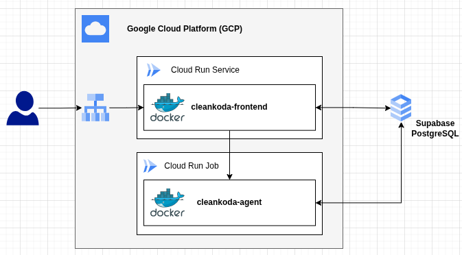
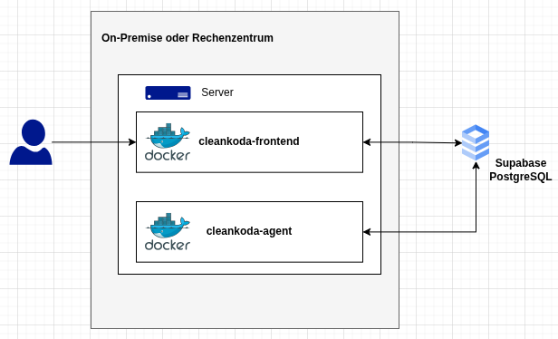

# CleanKoda Deployment-Strategien

CleanKoda wurde von Grund auf flexibel konzipiert, um sowohl als moderne Cloud-Lösung (SaaS) als auch in dedizierten, internen Firmennetzwerken betrieben werden zu können. 

Unabhängig von der gewählten Bereitstellungsmethode bleibt das grundlegende Technologie-Stack identisch:
- **Dockerisierung:** Das System ist strikt in zwei Container getrennt – das Frontend (Flask Web App) und den autonomen Worker (LangGraph-Agent & Workbench).
- **Datenbank:** In allen Setups fungiert Supabase als Single-Source-of-Truth für Metadaten, Konfigurationen und Authentifizierung.
- **Funktionalität:** Sowohl Issue-Tracking, als auch der "Trust-First"-Prinzip beim autonomen Entwickeln (Klonen, Testen, Commit, PR) funktionieren bei beiden Varianten nahtlos.

Der entscheidende Unterschied zwischen den beiden Deployment-Strategien liegt im **Lebenszyklus** und **Trigger-Mechanismus** für den rechenintensiven KI-Agenten.

---

## 1. Serverless Cloud Deployment (SaaS)
Dieser Ansatz zielt auf **maximale Kostenkontrolle ("Scale-to-Zero")** und unbegrenzte Skalierbarkeit ab. In einer öffentlichen Cloud wie der Google Cloud Platform (GCP) ist Rechenzeit kostspielig, weshalb ungenutzte Serverlaufzeiten ("Idle-Wait") kategorisch vermieden werden.

- **Frontend:** Läuft als dauerhaft reaktiver *Cloud Run Service*.
- **Agent:** Wird bedarfsgerecht (pro Ticket) als kurzlebiger *Cloud Run Job* gestartet ("Fire and Forget").
- **Trigger:** Ein "Shift-Left"-Verfahren: Das ressourcenschonende Frontend verifiziert (z. B. via User-Browser-Polling), ob eine tatsächliche Aufgabe im verbundenen System (Jira/Trello) vorliegt, bevor der Agent überhaupt gestartet wird.

👉 [Detailliertes Serverless-Architektur Dokument öffnen](./architecture-serverless.md)

---

## 2. On-Premise / Lokales Deployment
Dieser Ansatz ist optimal für Firmen mit dedizierten Servern, eigenen Rechenzentren (VMs) oder für die lokale Entwickler-Umgebung geeignet. Da auf eigenen Servern Minutentaktung und Serverless-Limitationen nicht relevant sind, wird auf ein durchgehend laufendes System gesetzt.

- **Frontend:** Läuft als permanenter Docker-Container in Docker Compose und lauscht auf Port 5000.
- **Agent:** Läuft in einem separaten, ebenfalls permanenten Docker-Container in einer Endlosschleife (`run_agent.py`). 
- **Trigger:** Hier entfällt das dynamische Wecken durch das Frontend komplett. Der permanent aktive Agent-Container übernimmt regelmäßiges Issue-Polling, das Abarbeiten und lokale Testen (inkl. lokaler Festplattencaches für Repositories via Docker-Volumes) vollkommen autark in einer Schleife.

👉 [Detailliertes On-Premise-Architektur Dokument öffnen](./architecture-on-premise.md)