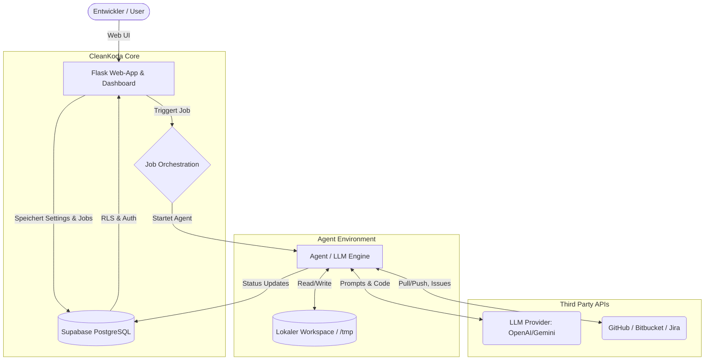

## Software Architektur

Dieses Dokument bietet einen strategischen High-Level-Überblick über die Architektur von CleanKoda. Detaillierte technische Spezifikationen zu spezifischen Unterthemen oder Deployment-Strategien wurden in dedizierte Dokumente ausgelagert, die hier entsprechend verlinkt sind.

### 1. Einleitung & Systemüberblick
CleanKoda ist ein KI-gestütztes Tool, das Software-Tickets (Issues) autonom analysiert, Code-Anpassungen vornimmt und diese als Pull-Requests in Repositories (z. B. GitHub, Bitbucket) zur Verfügung stellt. 
Die Architektur basiert auf der strikten Trennung zwei logischer Kernkomponenten:
- **Das User Frontend & Steuerungs-Backend (Flask):** Zuständig für das Web-Dashboard, die Verwaltung von Zugangsdaten, Billing, und die Orchestrierung der Agenten-Jobs.
- **Die isolierte Agenten-Engine:** Die eigentliche „Arbeiter-Umgebung“, in welcher der Code geklont wird und die LLMs (z. B. OpenAI, Anthropic) iterativ über LangGraph/LangChain an der Lösung arbeiten.

### 2. High-Level Komponenten-Diagramm



### 3. Deployment Modelle (Die Hybride Strategie)
Die Architektur ist so konzipiert, dass **exakt dieselbe Codebasis** zerschnitten und in völlig unterschiedlichen Umgebungen betrieben werden kann. Dies ermöglicht sowohl einen effizienten SaaS-Betrieb als auch eine Unternehmensintegration.

- **SaaS / Serverless Cloud:** Der Agent lebt nur für die Dauer eines Jobs. Maximale Kosteneffizienz durch "Scale-to-Zero".
  👉 *Details siehe: [`architecture-serverless.md`](./architecture-serverless.md)*
- **Enterprise / On-Premise Server:** Agent und App laufen als langlebige Container ("Long-Running") auf unternehmenseigener Hardware.
  👉 *Details siehe: [`architecture-on-premise.md`](./architecture-on-premise.md)*

### 4. Datenbank, Auth & Multi-Tenancy
CleanKoda setzt strikt auf eine zustandslose App-Architektur (Stateless). Jeglicher State, Sessions und Authentifizierungsprozesse werden über **Supabase** (Serverless PostgreSQL) abgewickelt. Dank Row Level Security (RLS) wird auf Datenbankebene sichergestellt, dass Daten zwischen Kundenkonten (Mandanten) strikt isoliert bleiben.
👉 *Details siehe: [`database.md`](./database.md)*

### 5. Guardrails & Ressourcenschutz
KI-Agenten können unvorhersehbar agieren oder in Schleifen geraten. Die Software-Architektur wird daher durch harte Sicherheitsleitplanken (Guardrails) auf Backend-Ebene geschützt. Diese Guardrails regeln die Laufzeiten, Repository-Größen und LLM-Kontingente dynamisch anhand der gebuchten Pläne.
👉 *Details siehe: [`guardrails.md`](../business/guardrails.md) & [`pricing.md`](../business/pricing.md)*


### 6. The Hybrid Strategy: Serverless & On-Premise from ONE Codebase

As shown in Chapter 2, we support two completely different deployment models from the exact same codebase using the DEPLOYMENT_MODE variable.

Architectural Comparison

| Property | SERVERLESS (SaaS / Cloud Run) | ON_PREMISE (Enterprise / On-Premise Server)
| ----------- | ------------------------------ | ----------------------------------------- |
| Trigger Logic | Flask starts a job via Google API | Flask starts a container via Docker API |
| Agent Lifecycle | 1 cycle -> Code push -> sys.exit(0) | Continuous loop (Waiting & Pulling) |
| Cost Impact | Scale-to-Zero (Costs only incurred during work) | Fixed costs (hardware runs 24/7 anyway) |

### 7. The lifecycle switch (in the agent run_agent.py)

The base image (`Dockerfile`) is identical for both worlds. The magic happens in the agent's Python entry point, where, depending on the mode, it either dies after one run or remains permanently alive:

```python
import os
import sys
import time
from langgraph_agent import run_single_cycle

def main():
    mode = os.environ.get("DEPLOYMENT_MODE", "SERVERLESS")
    
    if mode == "SERVERLESS":
        # 1 Zyklus und sofortige Selbstzerstörung (GCP Scale-to-Zero)
        print("Starte im Serverless-Modus...")
        run_single_cycle()
        print("Zyklus beendet. Container terminiert sich.")
        sys.exit(0) 
        
    elif mode == "ON_PREMISE":
        # Dauerbetrieb: Der Container wartet auf dem Enterprise-Server
        print("Starte im On-Premise Dauerbetrieb...")
        while True:
            has_work = run_single_cycle()
            if not has_work:
                print("Warte auf neues Ticket...")
                time.sleep(60) # Schlafen bis zum nächsten Prüf-Zyklus

if __name__ == "__main__":
    main()
```

This clean abstraction makes CleanKoda a B2B product ready for use by both cost-conscious startups (SaaS in the Google Cloud) and highly regulated corporations (on-premise in banks) without any additional architectural effort!
