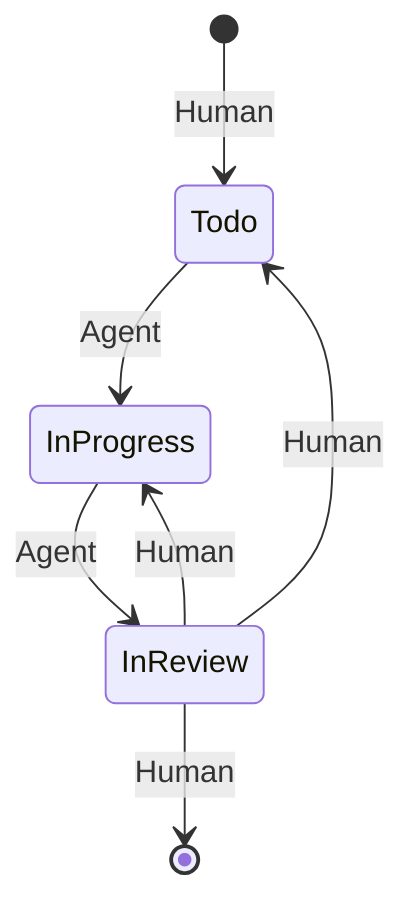
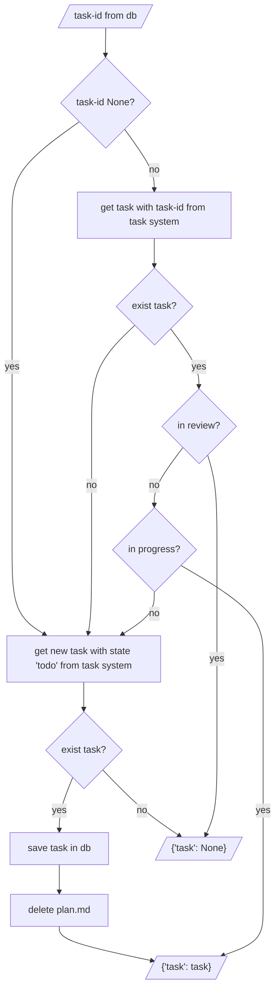

# Task Management System
## States
In a task management system, a task goes through several states: `Todo`, `In Progress`, `In Review`, and `Done`.

It can change these states through agent actions or human intervention, as shown in the following diagram.

## Human in the Loop
The agent and the human work together to complete the task. The agent has an executing role, while the human has a monitoring and controlling role.

- Backlog --> Todo: The human adds the task to the Todo column when it is to be processed by the agent.

- Todo --> In Progress: The agent takes the task and works on it.

- In Progress --> In Review: The agent has finished its work and hands it off to the human.

- In Review --> In Progress: The human reviews the result, provides feedback, and returns the task to the agent for further processing.

- In Review --> Todo: The human wants the agent to restart the task.

- In Review --> Done: The result is satisfactory; the human completes the task.

## Resuming the active task
The task remains active beyond the workflow cycle. Therefore, it is important that when a new agent cycle starts, the last processed task is resumed, provided it still exists. Only when it no longer exists can a new task be processed.

